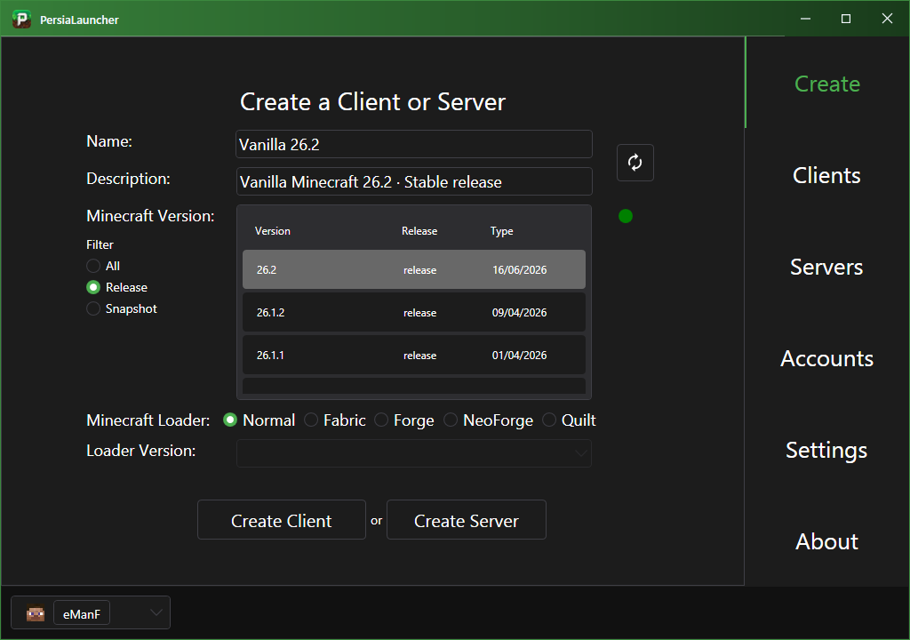
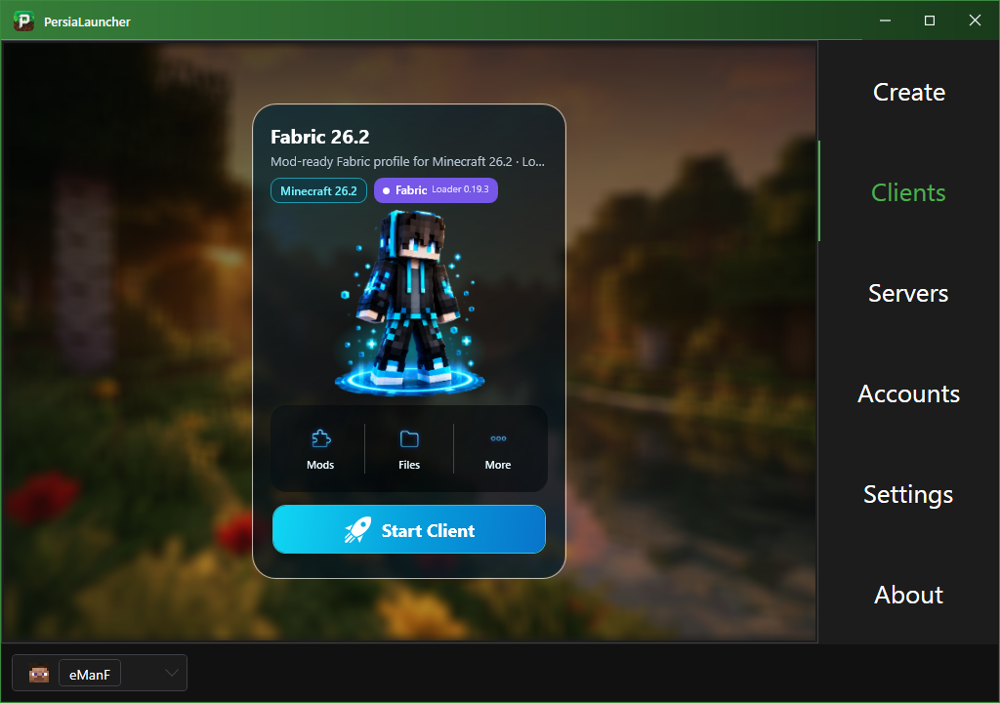
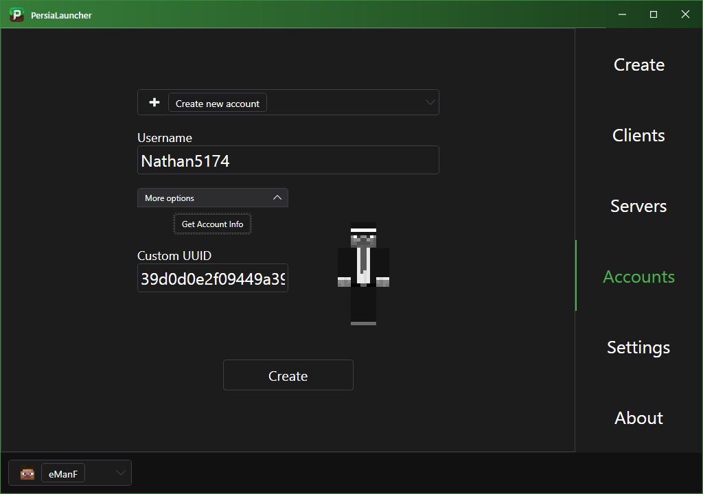
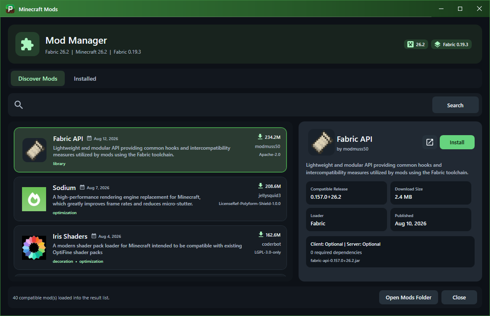

#  PersiaLauncher

**🌍 Языки:** [English](README.md) · [فارسی](README.fa.md) · [Русский](README.ru.md) · [Deutsch](README.de.md) · [Español](README.es.md)

> **Ваш Minecraft-мир. Ваши правила. Ваш лаунчер.**

PersiaLauncher — удобный и красивый лаунчер для управления клиентами, серверами, аккаунтами, Java и модами Minecraft.

Создавайте Vanilla-профили, собирайте модифицированные сборки и переключайтесь между версиями без лишних сложностей.

Поддерживаются:

**Vanilla · Fabric · Forge · NeoForge · Quilt**

## Возможности

- Управление разными клиентами Minecraft
- Управление серверами и мирами
- Отдельные профили для версий и модпаков
- Установка и управление модами
- Настройка Java, памяти и JVM-параметров
- Управление аккаунтами и скинами
- Темы, цвета и настройки окна
- Выбор пользовательской папки Minecraft

## Скриншоты

## Быстрый старт

1. Скачайте последнюю версию PersiaLauncher.
2. Выберите папку Minecraft.
3. Добавьте аккаунт или создайте профиль.
4. Выберите версию Minecraft и загрузчик.
5. Создайте профиль и запустите игру.

[Вернуться к README на английском](README.md)

Проект распространяется по [PersiaLauncher Community License](LICENSE) и разрешён для личного и коммерческого использования, публикации и загрузки.
